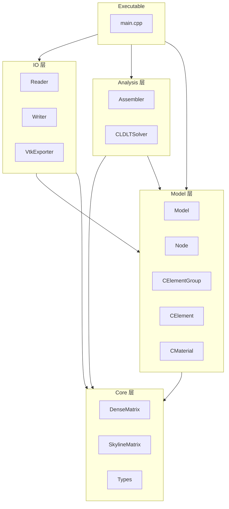
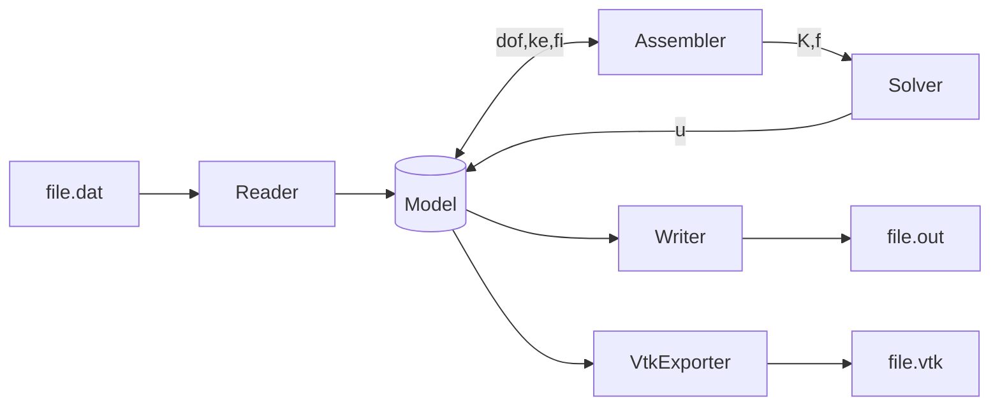
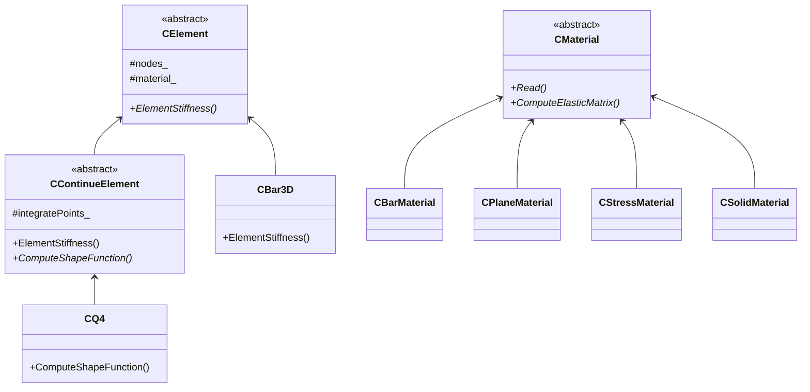

# MyFEM
[]
## 简介
这是一个完备的C++面向对象线弹性有限元程序
## 主要特性
- 现代C++11 面向对象架构
- 支持多种连续介质单元，Bar3D, Q4, H8
- 兼容混合单元网格形式
- 允许固定，指定位移边界条件
- 允许点载荷，面载荷，体载荷施加
- VTK 可视化输出
- 划行划列法施加边界约束以及约束力计算
- Skyline稀疏矩阵存储，LDLT求解 
## 构建
```shell
# 1.根目录上
mkdir build && cd build
cmake ..
# 2.若是选择构建Release版本
cmake --build .
# 2.所示选择构建Debug版本
cmake --build . --config Debug
# 最终生成的可执行文件位置
# build/bin/MyFEM
```
## 快速开始

## 架构
### 模块分层图

### 数据流

### 关键类设计


## 案例
案例运行命令
```shell
# 切换至exe目录下
cd build/bin
# 输入文件名，不加后缀运行
./MyFEM FileName
# 文件也可以相对路径的方式输入
./MyFEM ../Truss/FileName
```
### 演示案例：单一杆单元
单一杆单元受拉工况

### 演示案例：三杆单元
多杆单元受拉工况
### 演示案例：单一四边形单元
四边形单元受拉工况

### 演示案例：多四边形单元
### 演示案例：3D单元
## 未来规划
功能慢慢加