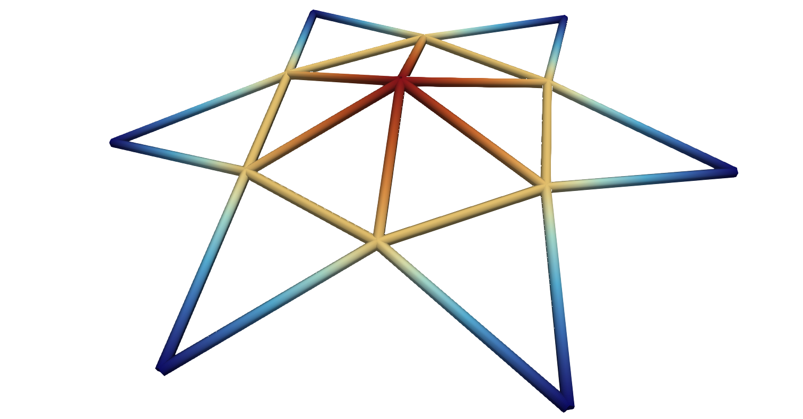
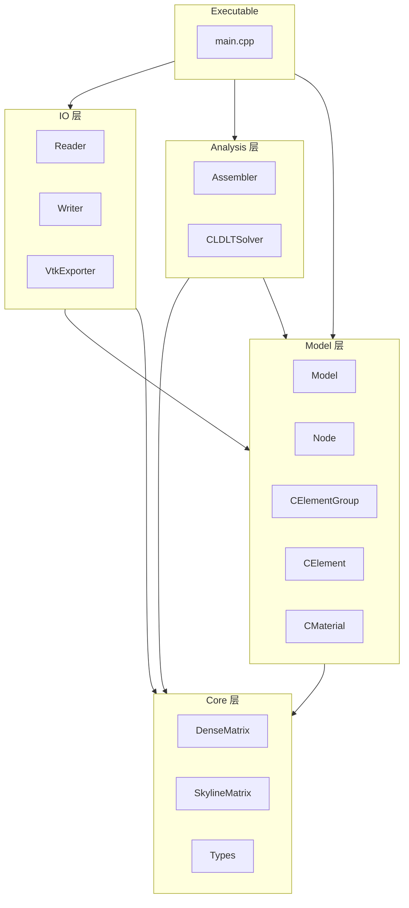
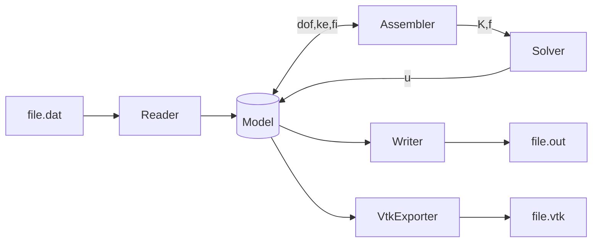
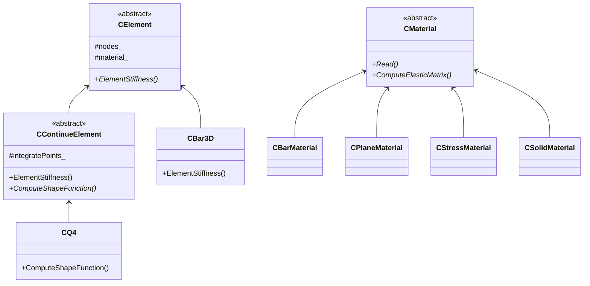

# MyFEM 一个C++有限元框架
<p align="center">
  
  <br><em>3D星形桁架: 节点位移与应力与ABAQUS结果一致</em>
</p>

[](https://github.com/pandappan/MyFEM/actions/workflows/ci.yml)
[](https://opensource.org/licenses/MIT)
[]()
[]()


> MyFEM是一个从零开始构建线弹性有限元框架，采用C++面向对象设计方法。

> 支持1D(杆单元)，2D(平面应力、应变单元)，3D(固体单元)有限元分析。

> 所有单元均通过经典基准案例与ABAQUS结果对比验证。

## 主要特性
- 现代C++11 面向对象架构，模块解耦程度高，增加新单元仅需150行代码。
- GoogleTest测试驱动，包含25+单元测试与3+集成测试案例。
- 支持多种连续介质单元：Bar3D, Q4, H8，兼容混合网格输入格式。
- 完整的载荷/边界条件处理：
能同时处理点载荷、面/线载荷、体载荷，固定约束、指定位移约束这类加载工况。 
此外还采用划行划列法处理边界约束与求解约束力。
- 完善的后处理以及可视化模块：
包含积分点的应力外推以及平滑处理功能，并且所有求解数据通过VTK文件可视化输出。
- 稀疏矩阵存储、求解：SkylineMatrix稀疏矩阵格式降低内存消耗，
LDLT直接法求解稀疏格式方程组。

## 架构
### 模块分层图

### 数据流

### 关键类设计

## 构建
```shell
# 1.根目录上
mkdir build && cd build
cmake ..
# 2.若是选择构建Release版本
cmake --build .
# 2.所示选择构建Debug版本
cmake --build . --config Debug
# 最终生成的可执行文件位置
# build/bin/MyFEM
```
## 快速开始
## 案例
案例运行命令
```shell
# 切换至exe目录下
cd build/bin
# 输入文件名，文件实际后缀为.dat，但是只需输入文件名
./MyFEM FileName
# 文件也可以相对路径的方式输入
./MyFEM ../Truss/FileName
```
### 演示案例：单一杆单元
单一杆单元受拉工况

### 演示案例：三杆单元
多杆单元受拉工况
### 演示案例：单一四边形单元
四边形单元受拉工况

### 演示案例：多四边形单元
### 演示案例：3D单元
## 未来规划
- MPC约束方程施加
- 剪切自锁问题
- 体积自锁问题
- 顺序热力耦合
- 梁板壳单元