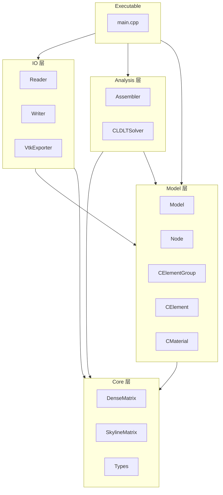
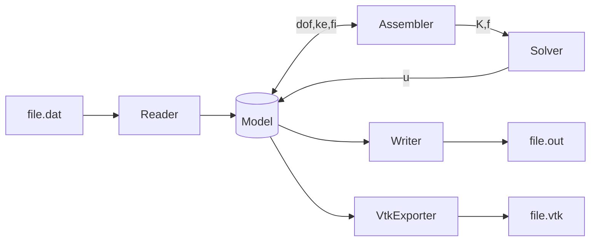
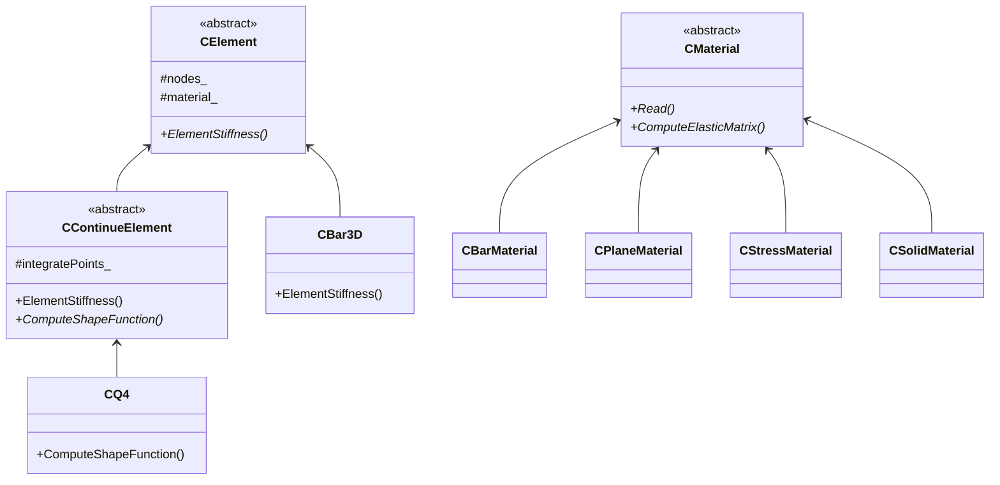
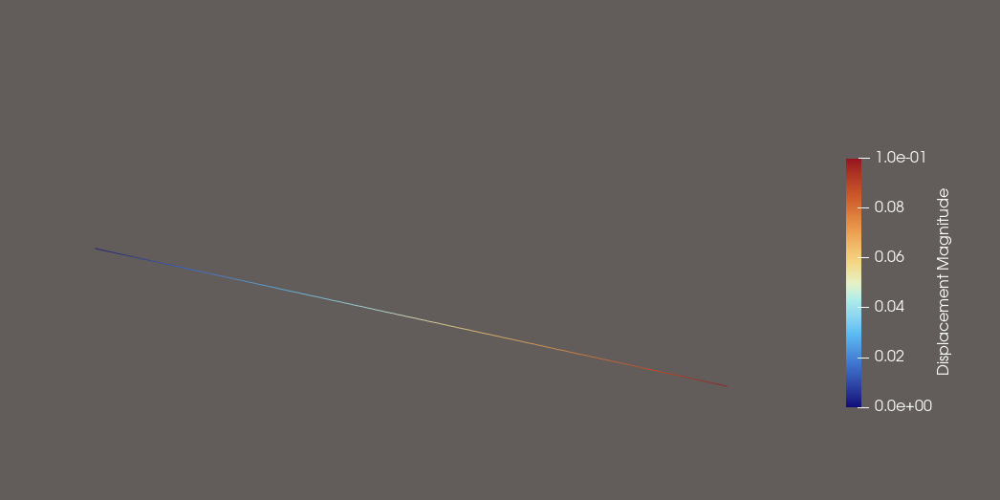
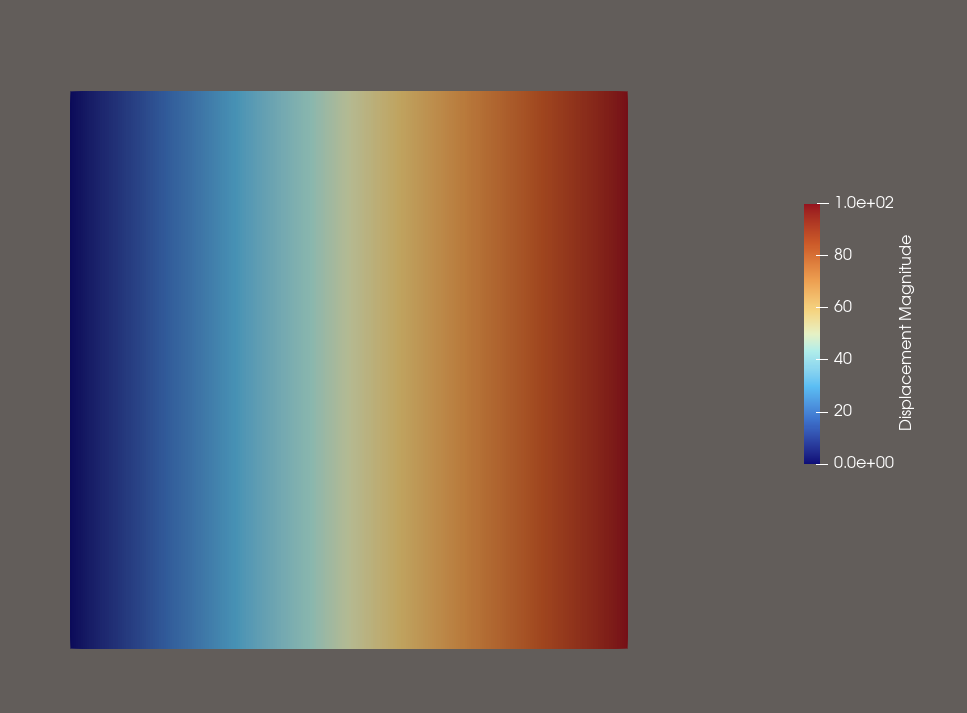

# MyFEM
[](https://github.com/pandappan/MyFEM/actions/workflows/ci.yml)
[](https://opensource.org/licenses/MIT)
[]()
[]()
## 简介
MyFEM是一个线弹性有限元框架，采用C++面向对象设计方法。
设计MyFEM的目的在于增强对有限元理论的认知，熟悉C++开发流程，
以及为刚接触面向对象有限元的同学提供参考。
程序虽然不大，但内容丰富，涵盖自由度管理，单元设计以及装配，
载荷以及边界条件施加等有限元理论的的核心理论。
不仅如此，MyFEM将有限元理论和面向对象的思想结合，合理布局各个模块，
程序解耦度高，易于扩展新功能。总体来说，这是一次漂亮的理论实践。

程序在设计思路上大量参考清华大学张雄老师开发的STAP++，
在此基础上做了大量的改进与扩展。
此外，程序在理论部分主要参考了《有限元单元法基础》，
《Introduction to Finite Element Analysis》。
## 主要特性
- 现代C++11 面向对象架构
- 支持多种连续介质单元，Bar3D, Q4, H8
- 兼容混合单元网格形式
- 允许固定，指定位移边界条件
- 允许点载荷，面载荷，体载荷施加
- 积分点应力外推+应力平滑处理
- VTK 可视化输出
- 划行划列法施加边界约束以及约束力计算
- Skyline稀疏矩阵存储，LDLT求解 
## 构建
```shell
# 1.根目录上
mkdir build && cd build
cmake ..
# 2.若是选择构建Release版本
cmake --build .
# 2.所示选择构建Debug版本
cmake --build . --config Debug
# 最终生成的可执行文件位置
# build/bin/MyFEM
```
## 快速开始

## 架构
### 模块分层图

### 数据流

### 关键类设计


## 案例
案例运行命令
```shell
# 切换至exe目录下
cd build/bin
# 输入文件名，不加后缀运行
./MyFEM FileName
# 文件也可以相对路径的方式输入
./MyFEM ../Truss/FileName
```
### 演示案例：单一杆单元
单一杆单元受拉工况

### 演示案例：三杆单元
多杆单元受拉工况
### 演示案例：单一四边形单元
四边形单元受拉工况

### 演示案例：多四边形单元
### 演示案例：3D单元
## 未来规划
功能慢慢加
## 参考资料
程序