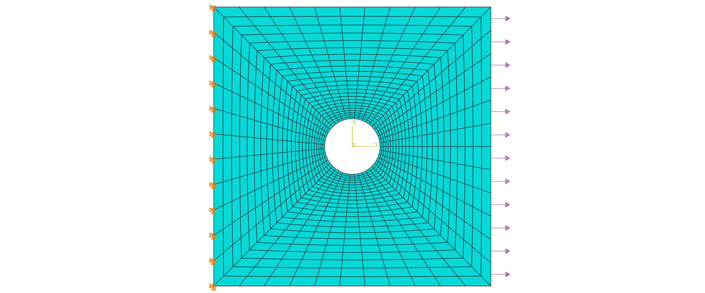
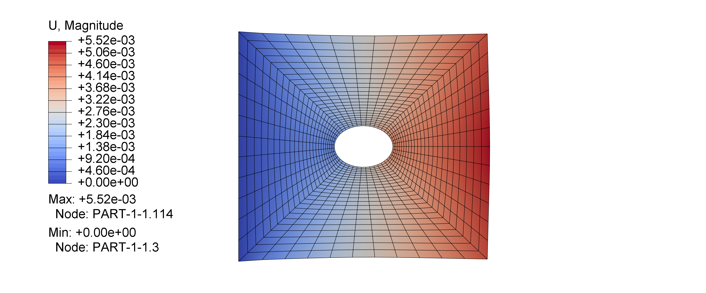
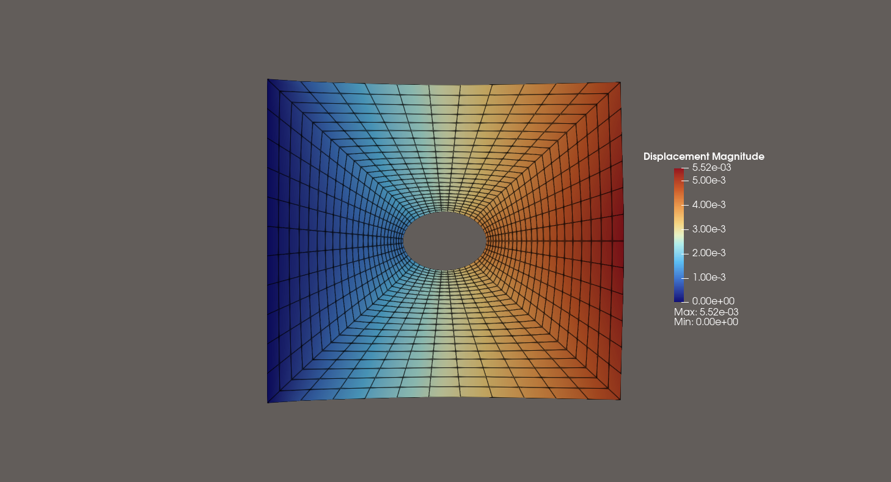
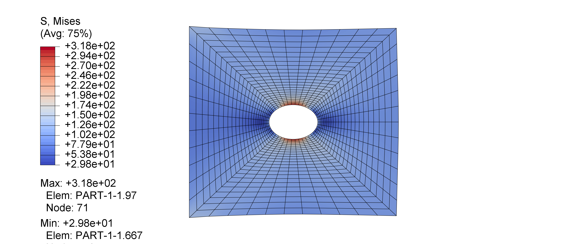
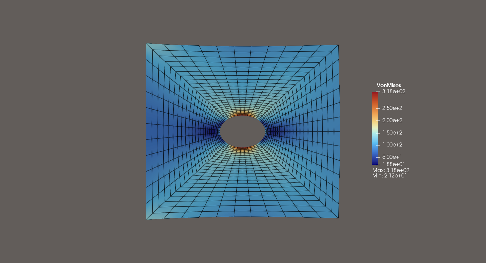

# 含孔方形板受拉案例
## 模型参数
尺寸为$10\times10\text{mm}$的方形板，内部开有一个半径为$1\text{mm}$的圆孔。
方形板的左端采用完全约束，右端受到面密度为$100\text{N/mm}^2$的均布拉力。
2D模型采用平面应力假设，假设厚度方向尺寸为1$\text{mm}$。

材料模型使用线弹性本构，弹性模量$E=207\text{e}^2\text{MPa}$，
泊松比$\nu=0.312$。
使用四边形进行网格划分，最大网格尺寸为$0.5\text{mm}$，最小为$0.1\text{mm}$，
网格总数约为1080。最终离散模型如下图所示：

## ABAQUS VS MyFEM 节点位移
最大节点位移结果
|                       | ABAQUS              | MyFEM               |
|-----------------------|---------------------|---------------------|
| 最大位移$(\text{mm})$ | 5.52$\text{e}^{-2}$ | 5.52$\text{e}^{-2}$ |
| 所属节点编号          | 114                 | 114                 |

对比最大位移结果可以发现，本程序最大位移的节点和最大值与ABAQUS计算结果一致。

ABAQUS节点位移云图：

MyFEM节点位移云图：

对比位移云图趋势可以发现，本程序的整体位移与ABAQUS结果一致。

## ABAQUS VS MyFEM VonMiss应力
最大应力结果：
|                       | ABAQUS              | MyFEM               |
|-----------------------|---------------------|---------------------|
| 最大Miss应力$(\text{MPa})$ | 3.18$\text{e}^{2}$ | 3.18$\text{e}^{2}$ |
| 所述单元编号          | 121                 | 121                 |

对比应力结果可以发现，本程序VonMiss应力的单元和最大值与ABAQUS计算结果一致。

ABAQUS阈值平滑Miss应力云图：

MyFEM面积加权平滑Miss应力云图：

对比VonMiss云图趋势可以发现，本程序的结果与ABAQUS结果一致。