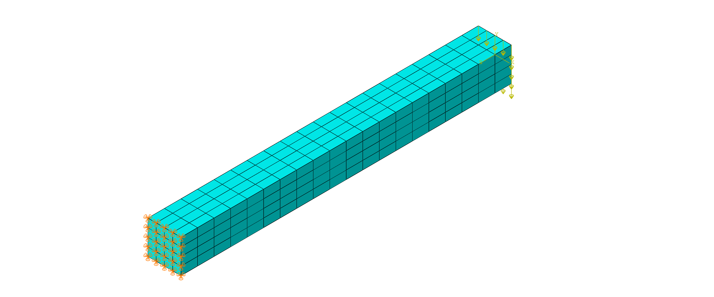
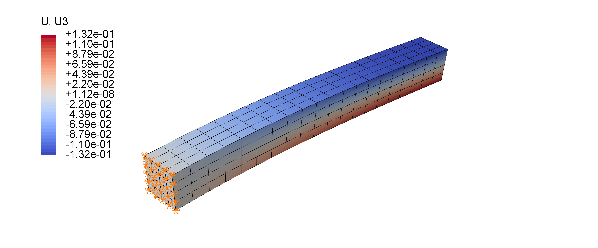
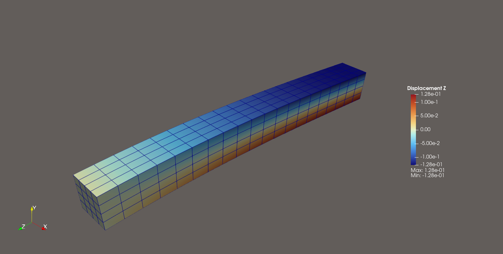

# 3D悬臂梁
## 模型参数
长方形杆长度为100$\text{mm}$，截面为10x10$\text{mm}$的正方形。
模型采用六面体网格进行离散，长度方向离散为20个单元，截面离散为4x4个
单元。左端采用固定约束，右端在每个节点Z的负方向施加40N的力，一共
1000N，观察悬臂梁最大的位移。注，ABAQUS中采用C3D8单元。

材料模型选用弹性本构，弹性模量$E=210e^3\text{MPa}$，泊松比$\nu=0.3$。
## ABAQUS VS MyFEM
最大位移对比：

ABAQUS:0.132$\text{mm}$

MyFEM: 0.128$\text{mm}$

误差大约3%，说明本程序与ABAQUS计算结果基本吻合。

变形云图：

ABAQUS云图

MyFEM云图
