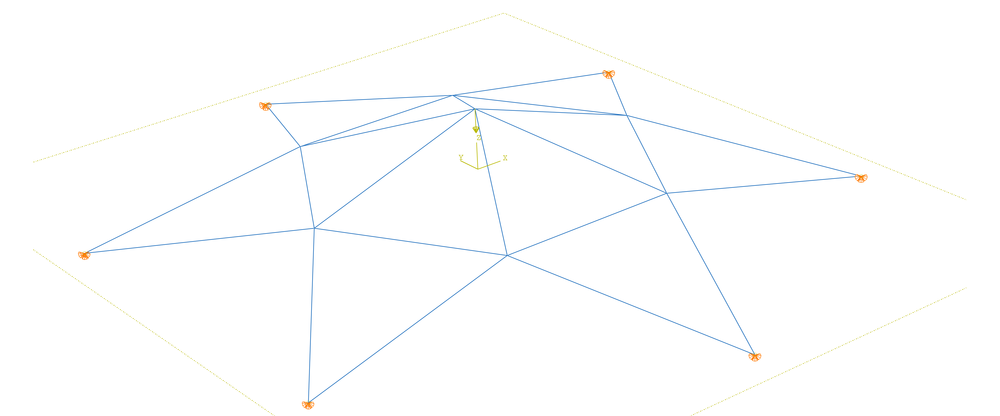
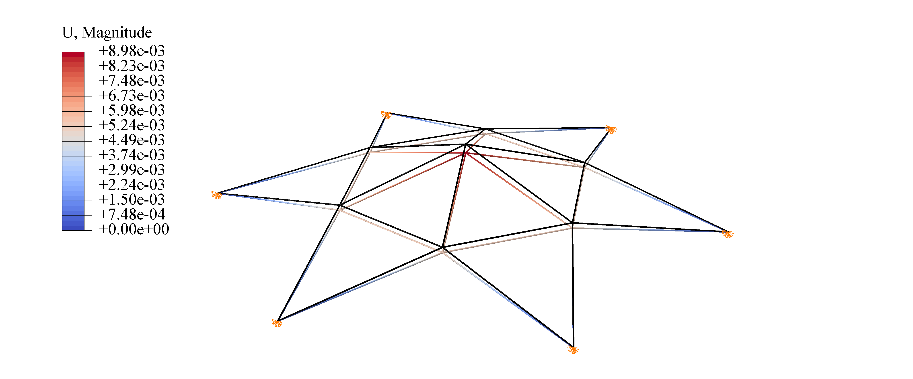
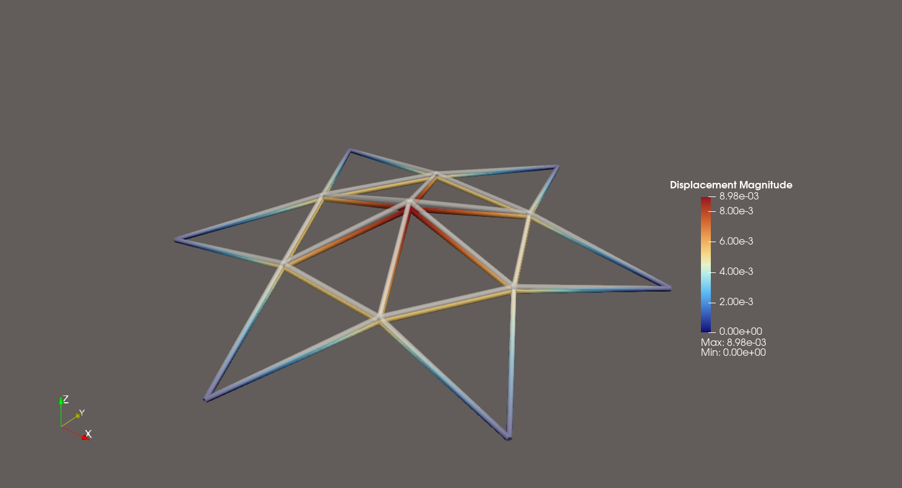
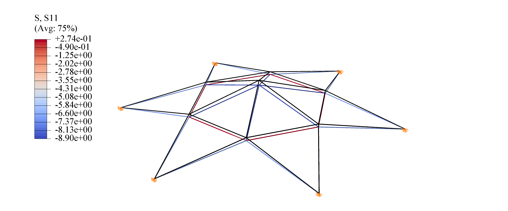
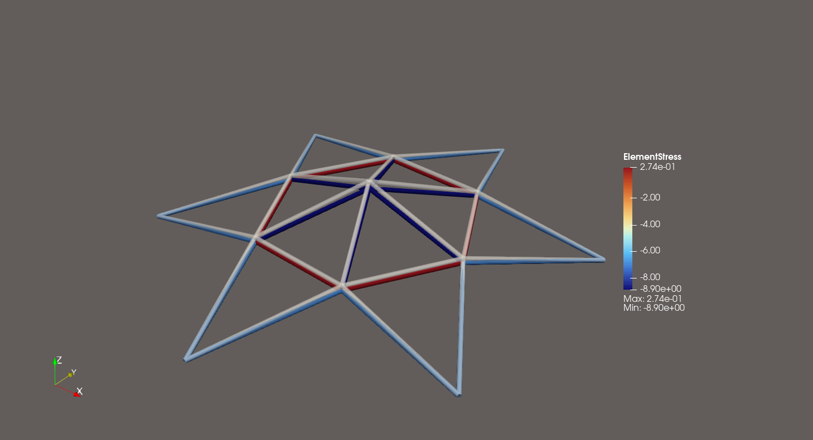

# 3D 桁架模型
## 模型参数
如下图所示的3D桁架：

低层半径为50$\text{mm}$，
中层半径为25$\text{mm}$，对应的高度为$6.216\text{mm}$，
顶层高度为8.216$\text{mm}$。
模型的低层顶点全部采用固定约束，顶部施加向下的大小为$100\text{N}$的集中力。
杆件之间采用铰接的方式，因此每根杆件可以简化为一个杆单元。

材料模型选择线弹性模型，弹性模量$E=210\text{e}^3\text{MPa}$，
截面积$A=6\text{mm}^2$。

## ABAQUS vs MyFEM

### 节点位移
最大节点位移比较：

ABAQUS最大节点位移8.98$\text{mm}$

MyFEM最大节点位移8.98$\text{mm}$

变形云图状态：

ABAQUS变形云图叠加未变形云图，放大200倍

MyFEM变形云图叠加未变形云图，放大200倍

### 杆单元应力
最大压应力

ABAQUS最大压应力：$-8.90\text{e}^-1\text{MPa}$，出现位置顶部杆单元

MyFEM最大压应力：$-8.90\text{e}^-1\text{MPa}$，出现位置顶部杆单元

最大拉应力比较:

ABAQUS最大拉应力：$2.74\text{e}^-1\text{MPa}$，出现位置：中层杆单元

MyFEM最大拉应力：$2.74\text{e}^-1\text{MPa}$，出现位置：中层杆单元

ABAQUS变形应力云图叠加未变形云图，放大200倍

MyFEM变形应力云图叠加未变形云图，放大200倍

## 总结
通过应力与位移的比较，可以看出MyFEM在复杂桁架模型中计算精度与ABAQUS一致。